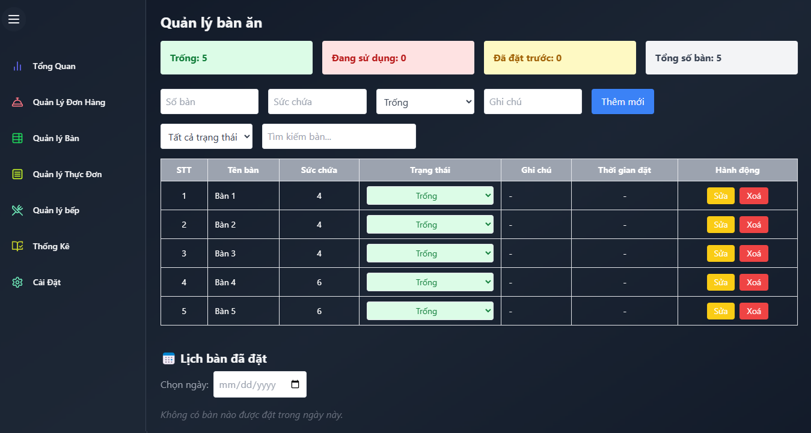

# Restaurant Management System

A full-featured Restaurant Management Web Application built with Microservices Architecture. The system helps restaurant staff manage orders, tables, kitchen workflow, menu, billing, and real-time revenue reports.

## Features

- Manage tables, menu items, and user roles (admin, waiter, chef)
- Create, update, and process orders in real-time
- Kitchen dashboard receives dishes via Kafka and updates status via WebSocket
- Invoice generation and revenue reporting
- Full real-time experience using WebSocket
- Bulk data import (CSV/Excel) using Spring Batch
- Full-text search with Elasticsearch
- High-performance caching with Redis
- Microservices communication using Kafka and gRPC
- Fully containerized with Docker & orchestrated by Kubernetes
- CI/CD ready

##  System Architecture
            [ React Frontend UI ]
                    |
    ┌───────────────┼────────────────┬────────────────────────────┐
    │               │                │                            │
    Waiter UI      Kitchen UI        Cashier UI                  Admin UI
    (Order)     (Real-time WS)     (Invoice/Report)           (CRUD Tables/Menu/Users)

## System Architecture Diagram


## Communication Flow Between Services
[User → React UI]
↓ (REST)
[Order Service]
↓ (Kafka: order.details → kitchen)
[Kitchen Service]
↓ (WebSocket)
[React UI Kitchen Dashboard]

[Order Service]
→ Kafka: menuId list
[Menu Service]
→ Kafka: menuName mapping

[Invoice Service]
→ Kafka: revenue data
[Report Service]
→ WebSocket → React UI Report

[Report Service]
→ gRPC → Invoice Service (lấy thống kê theo tháng)

## Tech Stack

### Backend
- Java 21 + Spring Boot
- Spring Web, Spring Data JPA, Spring Security
- Spring Kafka (asynchronous messaging)
- Spring Batch (CSV/Excel import)
- Spring WebSocket
- gRPC for fast inter-service communication

### Frontend
- ReactJS with modern component structure
- Real-time updates via WebSocket
- Axios for API calls
- TailwindCSS / Material UI (optional)

### Infrastructure
- MySQL (relational data storage)
- Redis (caching)
- Elasticsearch (search)
- Kafka (message broker)
- Docker + Kubernetes (container orchestration)
- GitHub Actions / GitLab CI for CI/CD

## Microservices

| Service         | Description                                                         |
|-----------------|---------------------------------------------------------------------|
| User Service    | Manage employees, grant employee rights, add, edit, delete          |
| Order Service   | Handles order creation, updates, and dispatch                       |
| Menu Service    | Manages the restaurant's menu items                                 |
| Kitchen Service | Receives dishes from Order Service, updates status in real-time     |
| Invoice Service | Generates invoices and calculates revenue                           |
| Report Service  | Receives revenue data via Kafka and updates dashboard via WebSocket |

## How to Run (Local)

1. **Clone the project**

```bash
git clone https://github.com/nguyenchitien98/restaurant
cd restaurant

Start services using Docker Compose
docker-compose up --build

```
## Application Screenshots
### Order Management Screen
#### Displays all current orders, with options to edit, view details, and update status.
<p align="center">  </p>

### After Placing an Order
#### An example of how an order appears after submission.
<p align="center">  </p>

### Table Management Screen
#### Manage restaurant tables, view status (occupied/available), capacity, and assign orders.
<p align="center">  </p>

### Menu Management Screen
#### CRUD interface for managing food and drink items on the menu.
<p align="center">  </p>

### Kitchen Management Screen
#### Monitor food preparation process in real-time. Orders are sent from Order Service via Kafka and displayed here using WebSocket.
<p align="center">  </p>

### After Receiving an Order in Kitchen
#### Live update when new orders arrive from the Order Service.
<p align="center">  </p>


## Author
Nguyễn Chí Tiến - Fullstack Developer

Email: tiennguyenchi98@gmail.com

GitHub: https://github.com/nguyenchitien98
